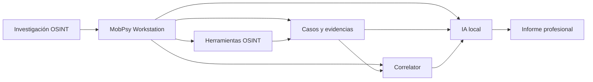
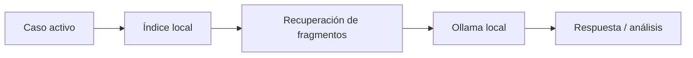
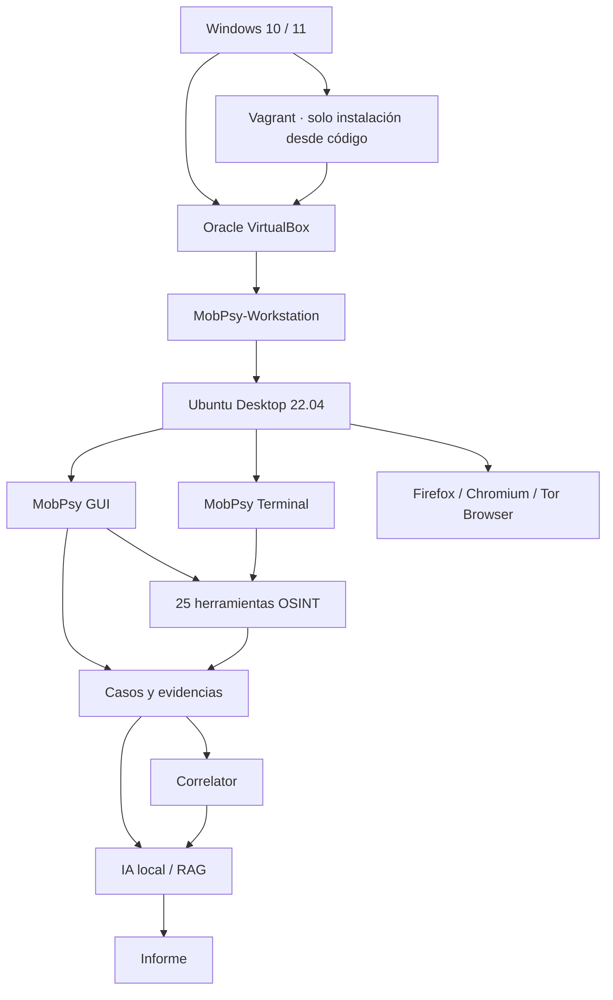

<div align="center">


# MobPsy

### OSINT Workstation reproducible con gestión de casos, correlación e IA local

**Ubuntu Desktop · VirtualBox · Vagrant · OSINT · Ciberinteligencia · Ollama**

[](./VERSION.txt)
[](#requisitos)
[](#arquitectura)
[](#requisitos)
[](#requisitos)
[](#herramientas-integradas)

**[⬇️ Descargar MobPsy OVA](__OVA_DOWNLOAD_URL__)** ·
[Instalación desde código](#opción-2--instalación-desde-código) ·
[Manual rápido](#uso-de-mobpsy) ·
[Herramientas](#herramientas-integradas)

</div>

---

## ¿Qué es MobPsy?

**MobPsy** es una workstation Linux de escritorio orientada a investigaciones **OSINT y ciberinteligencia**, diseñada para agrupar en un único entorno herramientas de investigación, gestión de evidencias, correlación de resultados y análisis asistido mediante IA local.

El objetivo del proyecto no es simplemente instalar una colección de herramientas. MobPsy proporciona un **entorno de trabajo reproducible** en el que una investigación puede mantenerse organizada desde la recogida inicial de información hasta la consolidación de evidencias y la elaboración del informe.

La workstation dispone de una interfaz gráfica propia, una terminal guiada, navegador preparado para investigación, gestión de casos, exportaciones, hashes SHA-256, correlación de resultados y un analista IA local que trabaja sobre el expediente activo.

> [!IMPORTANT]
> MobPsy está pensado para investigación legítima, análisis defensivo, formación y OSINT sobre información pública o sistemas para los que se disponga de autorización. El usuario es responsable de utilizar cada herramienta conforme a la legislación y a los términos de servicio aplicables.

---

## Características principales

| Característica | Descripción |
|---|---|
| 🖥️ **Workstation gráfica real** | Ubuntu Desktop completamente utilizable como un PC normal, con ventanas, ratón, navegador y terminal. |
| 🧭 **Interfaz MobPsy** | Aplicación gráfica centralizada para acceder a herramientas y módulos de investigación. |
| 📁 **Gestión de casos** | Creación de investigaciones, selección de caso activo, evidencias, exportaciones e historial de ejecuciones. |
| 🔐 **Integridad de evidencias** | Registro de hashes SHA-256 para los archivos incorporados al expediente. |
| 🔗 **Correlator** | Consolidación de entidades y relaciones encontradas en distintas fuentes. |
| 🧠 **IA OSINT local** | Ollama + modelo especializado `mobpsy-osint:latest`, sin enviar el expediente a un servicio de IA externo. |
| 📚 **RAG del caso** | La IA indexa el contenido del caso activo y recupera fragmentos relevantes antes de responder. |
| 📝 **Informes profesionales** | Resumen ejecutivo, pruebas relevantes, hallazgos consolidados, correlación, análisis, cronología, limitaciones y conclusiones. |
| 🌐 **Navegadores preparados** | Firefox/Chromium, marcadores OSINT y extensiones administradas por la workstation. |
| 🧅 **Tor Browser** | Disponible como herramienta adicional de navegación cuando el flujo de investigación lo requiera. |
| ⌨️ **MobPsy Terminal** | Acceso guiado a las mismas herramientas desde terminal. |
| 🔄 **Actualizaciones** | Comprobación y aplicación de nuevas versiones mediante GitHub Releases. |
| 📦 **Dos formas de despliegue** | OVA lista para importar o instalación reproducible desde código con Vagrant. |

---

## Vista general



MobPsy intenta mantener una separación clara entre:

- **datos observados** en evidencias y exportaciones;
- **correlaciones** obtenidas al encontrar entidades repetidas en distintas fuentes;
- **inferencias** realizadas durante el análisis;
- **hipótesis** que todavía necesitan ser verificadas.

---

# Instalación

MobPsy puede utilizarse de dos formas.

## Opción 1 — OVA preconfigurada (recomendada)

Es la opción más sencilla para la mayoría de usuarios.

### 1. Descargar la OVA

**[⬇️ Descargar MobPsy v1.0.0 OVA](__OVA_DOWNLOAD_URL__)**

Archivo esperado:

```text
MobPsy-v1.0.0.ova
```

SHA-256 oficial:

```text
__OVA_SHA256__
```

> [!TIP]
> El archivo OVA se distribuye externamente porque supera el límite por archivo de GitHub Releases. El código fuente y el historial del proyecto permanecen en GitHub.

### 2. Instalar VirtualBox

Instala una versión compatible de **Oracle VirtualBox 7.x**.

Para utilizar únicamente la OVA **no necesitas Vagrant**.

### 3. Importar la appliance

En VirtualBox:

```text
Archivo
└── Importar servicio virtualizado
    └── seleccionar MobPsy-v1.0.0.ova
```

Mantén como nombre de la máquina:

```text
MobPsy-Workstation
```

### 4. Iniciar MobPsy

Ejecuta desde este repositorio:

```text
MOBPSY.bat
```

El menú detectará automáticamente que existe una OVA importada y utilizará **VirtualBox directamente**.

```text
Modo detectado: OVA importada
Estado: poweroff / running
```

No se necesita `.vagrant` para esta modalidad.

---

## Opción 2 — Instalación desde código

Esta modalidad reconstruye la workstation mediante Vagrant y los scripts de aprovisionamiento incluidos en el repositorio.

### Requisitos

- Windows 10 u 11 de 64 bits.
- Oracle VirtualBox 7.x.
- Vagrant 2.4.x.
- Virtualización por hardware habilitada en BIOS/UEFI.
- Conexión a Internet durante la instalación.
- Espacio libre suficiente para la VM, herramientas y modelo IA.
- Recomendado: **16 GB de RAM en el host**.
- Recomendado: **4 núcleos de CPU o más**.

### Instalación

Clona el repositorio:

```powershell
git clone https://github.com/alvarosr/mobpsy.git
cd mobpsy
```

Ejecuta:

```text
MOBPSY.bat
```

Selecciona:

```text
Instalar MobPsy desde código
```

El proceso crea y configura automáticamente `MobPsy-Workstation`.

> [!NOTE]
> Vagrant generará una carpeta `.vagrant` local en tu ordenador. Esa carpeta contiene estado específico de tu instalación y **no forma parte del proyecto ni debe subirse a GitHub**.

---

## Credenciales iniciales

```text
Usuario:     mobpsy
Contraseña: mobpsy
```

> [!IMPORTANT]
> Si vas a utilizar la workstation de forma habitual, cambia la contraseña inicial después de comprobar que todo funciona correctamente.

---

# Un único menú: `MOBPSY.bat`

La edición pública está diseñada para que el usuario **solo necesite ejecutar un archivo**:

```text
MOBPSY.bat
```

El resto de scripts son componentes internos del proyecto.

El panel distingue automáticamente entre:

```text
OVA importada
```

y:

```text
Instalación desde código / Vagrant
```

### Funciones disponibles

```text
INSTALACIÓN Y ESTADO
├── Detectar instalación
└── Instalar MobPsy desde código

WORKSTATION
├── Iniciar MobPsy
├── Apagar MobPsy
└── Diagnóstico

MANTENIMIENTO
├── Comprobar actualizaciones
├── Actualizar MobPsy
├── Actualizar herramientas
├── Actualizar Ubuntu
└── Actualizar marcadores

AYUDA
└── Información sobre OVA, Vagrant y uso
```

Las opciones que dependen de Vagrant solo se utilizan cuando la workstation fue creada desde código.

---

# Uso de MobPsy

Una vez iniciado Ubuntu, abre **MobPsy** desde el escritorio o el lanzador de aplicaciones.

La interfaz agrupa el trabajo en módulos orientados a una investigación real.

## Personas e identidad

Investigación de nombres de usuario, presencia pública y relaciones con organizaciones.

Herramientas principales:

- Sherlock
- Maigret
- CrossLinked
- ClatScope

## Correos electrónicos

Análisis de direcciones de correo y señales públicas asociadas.

- Holehe
- ProtOSINT
- Zehef

## Teléfonos

- PhoneInfoga

## Redes sociales

- Social-Analyzer
- Instaloader

## Multimedia y metadatos

- ExifTool
- MediaInfo

## DNS y subdominios

- Subfinder
- DNSRecon
- dig
- host

## Direcciones IP

- Whois
- GeoIPLookup

## Web e infraestructura

- WhatWeb
- WAFW00F
- Photon
- theHarvester

## Frameworks OSINT

- SpiderFoot
- Recon-ng
- sn0int

---

# Herramientas integradas

MobPsy 1.0.0 incorpora **25 herramientas/utilidades OSINT** organizadas por función.

| Nº | Categoría | Herramienta | Uso principal |
|---:|---|---|---|
| 01 | Personas | **Sherlock** | Búsqueda de usernames en múltiples plataformas |
| 02 | Personas | **Maigret** | Dossier de presencia pública de usernames |
| 03 | Personas | **CrossLinked** | Relación de nombres públicos con organizaciones |
| 04 | Personas | **ClatScope** | Suite OSINT multipropósito |
| 05 | Correos | **Holehe** | Señales de registro asociadas a emails |
| 06 | Correos | **ProtOSINT** | Análisis OSINT de cuentas Proton |
| 07 | Correos | **Zehef** | Información pública asociada a correos |
| 08 | Teléfonos | **PhoneInfoga** | Análisis de números de teléfono |
| 09 | Redes sociales | **Social-Analyzer** | Búsqueda de usernames en plataformas sociales |
| 10 | Redes sociales | **Instaloader** | Información pública de perfiles de Instagram |
| 11 | Multimedia | **ExifTool** | Extracción de metadatos |
| 12 | Multimedia | **MediaInfo** | Información técnica de audio y vídeo |
| 13 | DNS | **Subfinder** | Enumeración pasiva de subdominios |
| 14 | DNS | **DNSRecon** | Enumeración y análisis DNS |
| 15 | DNS | **dig** | Consultas de registros DNS |
| 16 | DNS | **host** | Resolución rápida de nombres |
| 17 | IPs | **Whois** | Información WHOIS |
| 18 | IPs | **GeoIPLookup** | Geolocalización básica de IP |
| 19 | Web / Infraestructura | **WhatWeb** | Identificación de tecnologías web |
| 20 | Web / Infraestructura | **WAFW00F** | Detección de WAF |
| 21 | Web / Infraestructura | **Photon** | Crawling y extracción de información pública |
| 22 | Web / Infraestructura | **theHarvester** | Recopilación OSINT de dominios |
| 23 | Frameworks | **SpiderFoot** | Framework automatizado de OSINT |
| 24 | Frameworks | **Recon-ng** | Framework modular de reconocimiento |
| 25 | Frameworks | **sn0int** | Framework OSINT modular |

> [!NOTE]
> Las herramientas de terceros conservan sus propias licencias, requisitos, fuentes de datos y condiciones de uso. MobPsy actúa como entorno de integración y no modifica esas condiciones.

---

# Casos y evidencias

MobPsy incorpora un sistema de expedientes para evitar que una investigación termine siendo una colección desordenada de archivos.

Cada caso puede contener:

```text
Caso
├── manifiesto
├── evidencias
├── exportaciones de herramientas
├── historial de ejecuciones
├── análisis
├── correlaciones
└── informes
```

### Caso activo

Una investigación puede establecerse como **caso activo**. A partir de ese momento, las herramientas compatibles pueden registrar automáticamente su ejecución y asociar exportaciones al expediente.

### Evidencias

Los archivos incorporados al caso se almacenan con información de trazabilidad y hash SHA-256.

### Exportaciones

Los resultados producidos por herramientas OSINT pueden incorporarse al expediente para ser analizados posteriormente.

---

# Correlator

El módulo **Correlator** intenta encontrar elementos repetidos y relaciones entre distintas fuentes de un mismo caso.

Ejemplos:

```text
mismo correo
    ├── exportación A
    ├── evidencia B
    └── resultado C

mismo username
    ├── Sherlock
    ├── Maigret
    └── Social-Analyzer
```

La correlación **no implica automáticamente identidad o atribución**. MobPsy la utiliza como apoyo para que el analista pueda distinguir entre:

- coincidencia;
- corroboración documental;
- relación probable;
- conclusión demostrada.

Los resultados pueden utilizarse posteriormente en los informes del caso.

---

# Analista IA OSINT

MobPsy integra una IA local mediante **Ollama**.

Modelo utilizado por la configuración estable:

```text
mobpsy-osint:latest
```

basado en un modelo compacto optimizado para funcionar dentro de la VM.

## Privacidad

El análisis se realiza localmente dentro de la workstation.



El expediente no necesita enviarse a un proveedor de IA en la nube para utilizar esta función.

## Acceso a los archivos del caso

La capa RAG recorre el expediente activo e intenta extraer texto de:

- TXT / Markdown / logs
- JSON
- CSV / TSV
- XML / HTML
- PDF
- DOC / DOCX
- XLSX
- PPTX
- ODT / ODS / ODP
- imágenes mediante OCR cuando es posible
- algunos binarios mediante extracción de cadenas como último recurso

El índice se actualiza cuando cambia el contenido del expediente.

## Búsqueda exacta

Consultas como:

```text
¿En qué fuentes aparece exactamente usuario123?
```

pueden resolverse mediante búsqueda literal sobre el índice del caso, evitando que el modelo tenga que adivinar en qué archivos aparece el dato.

## Límites

La IA es una ayuda para el analista, no una fuente probatoria.

Una respuesta generada debe contrastarse siempre con:

- la evidencia original;
- las exportaciones;
- los hashes;
- los resultados del correlator;
- las fuentes externas utilizadas durante la investigación.

---

# Informes

El generador de informes intenta mantener separados los **datos observados** de la **interpretación**.

La estructura prevista incluye:

1. Resumen ejecutivo.
2. Alcance y metodología.
3. Fuentes y pruebas relevantes.
4. Hallazgos consolidados.
5. Correlaciones.
6. Análisis e interpretación.
7. Cronología.
8. Limitaciones.
9. Conclusiones.
10. Inventario técnico y hashes.

Los datos repetidos se consolidan para evitar presentar la misma observación como varios hallazgos diferentes.

Un elemento presente en varias fuentes puede marcarse como **corroborado documentalmente**, pero esto no debe confundirse con una atribución de identidad.

---

# MobPsy Terminal

Además de la interfaz gráfica, la workstation dispone de una interfaz de terminal orientada a usuarios que prefieran trabajar mediante comandos.

Los wrappers utilizan el prefijo:

```text
mobpsy-
```

Ejemplos:

```bash
mobpsy-sherlock usuario123 --print-found --no-color
mobpsy-holehe persona@example.com --only-used --no-color
mobpsy-phoneinfoga scan -n "+34 600 000 000"
mobpsy-subfinder -d example.com -silent
mobpsy-dnsrecon -d example.com -t std
mobpsy-whatweb https://example.com
mobpsy-theharvester -d example.com -b crtsh
```

Para la interfaz guiada de terminal:

```bash
mobpsy-cli
```

---

# Navegación

La workstation incorpora:

- Firefox
- Chromium
- Tor Browser
- marcadores OSINT organizados
- extensiones administradas por MobPsy

El navegador es parte del entorno de investigación, pero **Tor Browser no convierte automáticamente toda la workstation en tráfico Tor**. Cada herramienta conserva su propio modelo de red y debe utilizarse de acuerdo con su documentación.

---

# Arquitectura



---

# Estructura del repositorio

```text
MobPsy/
├── MOBPSY.bat
├── Vagrantfile
├── VERSION.txt
├── README.md
├── RELEASE_NOTES.md
├── assets/
│   ├── mobpsy_logo.png
│   └── mobpsy_wallpaper.png
├── bookmarks/
├── mobpsy_analysis/
│   ├── mobpsy_ai.py
│   ├── mobpsy_case_index.py
│   ├── mobpsy_correlate.py
│   └── mobpsy_report_engine.py
├── mobpsy_app/
├── mobpsy_cases/
├── mobpsy_cli/
├── provision/
└── _mobpsy/
    └── componentes internos del menú público
```

### ¿Por qué no está `.vagrant`?

Porque `.vagrant` contiene estado local de una instalación concreta:

- UUID de la máquina;
- referencias al proveedor;
- metadatos específicos del host.

Debe generarse en cada ordenador mediante Vagrant y está excluido del repositorio.

La **OVA tampoco depende de `.vagrant`**: cuando se importa, `MOBPSY.bat` detecta `MobPsy-Workstation` directamente mediante VirtualBox.

---

# Actualizaciones

MobPsy puede comprobar nuevas versiones publicadas en GitHub Releases.

Desde el menú principal:

```text
MOBPSY.bat
└── Mantenimiento
    ├── Comprobar actualizaciones
    └── Actualizar MobPsy
```

El sistema diferencia entre una instalación creada con Vagrant y una OVA importada.

---

# Resolución de problemas

## `MobPsy-Workstation` no aparece

Comprueba que:

1. VirtualBox está instalado.
2. La OVA se importó correctamente.
3. La VM conserva el nombre `MobPsy-Workstation`.

## `vagrant` no se reconoce

Solo afecta a instalaciones desde código.

Instala Vagrant y abre una nueva consola.

## La virtualización no está disponible

Comprueba en BIOS/UEFI:

- AMD-V / SVM para AMD;
- Intel VT-x para Intel.

También revisa conflictos con hipervisores adicionales del sistema anfitrión.

## La IA tarda en responder

La IA se ejecuta localmente dentro de la máquina virtual. El rendimiento depende especialmente de:

- CPU asignada a la VM;
- memoria disponible;
- carga simultánea del navegador y otras herramientas;
- tamaño del expediente.

Las preguntas de metadatos simples pueden resolverse sin invocar el modelo y las preguntas analíticas utilizan recuperación de fragmentos para reducir carga.

## Una herramienta no responde

Ejecuta:

```text
MOBPSY.bat
→ Diagnóstico
```

y revisa también la ayuda de la herramienta desde MobPsy Terminal.

---

# Seguridad y privacidad

MobPsy intenta mantener los datos de una investigación dentro de la workstation, pero **no todas las herramientas son offline**.

Las utilidades OSINT pueden contactar:

- buscadores;
- redes sociales;
- APIs;
- DNS;
- sitios web;
- servicios de terceros.

Antes de utilizar una herramienta en un caso sensible, revisa:

1. qué información envía;
2. a qué servicio se conecta;
3. si utiliza una API;
4. si requiere una cuenta;
5. los términos y políticas de la fuente consultada.

La IA integrada mediante Ollama es local, pero las herramientas OSINT mantienen su comportamiento de red habitual.

---

# Verificación de descargas

Para verificar una descarga mediante SHA-256 en PowerShell:

```powershell
Get-FileHash .\MobPsy-v1.0.0.ova -Algorithm SHA256
```

Compara el resultado con el SHA-256 publicado junto a la versión.

---

# Desarrollo

El despliegue desde código está dividido en provisionadores para evitar un instalador monolítico difícil de mantener.

Ejemplos:

```text
provision/workstation.sh
provision/desktop.sh
provision/browser_bookmarks.sh
provision/browser_extensions.sh
provision/cases.sh
provision/analysis.sh
provision/ai_local.sh
provision/tool_audit.sh
```

Esto permite mantener una instalación reproducible sin convertir la terminal o la aplicación gráfica en el mecanismo de despliegue.

---

# Contribuciones

Las incidencias y propuestas de mejora pueden abrirse mediante **GitHub Issues**.

Cuando informes de un problema intenta incluir:

- versión de MobPsy;
- Windows utilizado;
- versión de VirtualBox;
- versión de Vagrant, si aplica;
- opción del menú utilizada;
- mensaje de error completo;
- captura de pantalla cuando aporte contexto.

No publiques en una issue:

- contraseñas;
- tokens;
- claves API;
- nombres reales de casos privados;
- evidencias;
- información personal obtenida durante una investigación.

---

# Roadmap

Áreas previstas de evolución:

- mejora continua del motor de correlación;
- mayor normalización de resultados entre herramientas;
- ampliación del análisis local asistido por IA;
- mejora del sistema de informes;
- nuevas integraciones OSINT;
- endurecimiento y validación de la appliance;
- automatización del ciclo de releases.

---

# Créditos y proyectos de terceros

MobPsy integra herramientas desarrolladas por distintos proyectos open source.

Cada herramienta mantiene:

- su autoría;
- su repositorio original;
- su licencia;
- sus condiciones de uso.

MobPsy no reclama autoría sobre software de terceros.

---

# Aviso legal

MobPsy es un entorno de investigación y análisis.

No está diseñado para autorizar accesos no permitidos, eludir controles de acceso ni realizar actividades ilegales.

El usuario debe:

- trabajar únicamente dentro de un marco legal;
- disponer de las autorizaciones necesarias;
- respetar las condiciones de uso de los servicios consultados;
- proteger adecuadamente la información obtenida durante una investigación.

---

<div align="center">

### MobPsy 1.0.0

**OSINT Workstation · Cases · Correlation · Local AI**

Código fuente y seguimiento del proyecto en GitHub.

</div>
